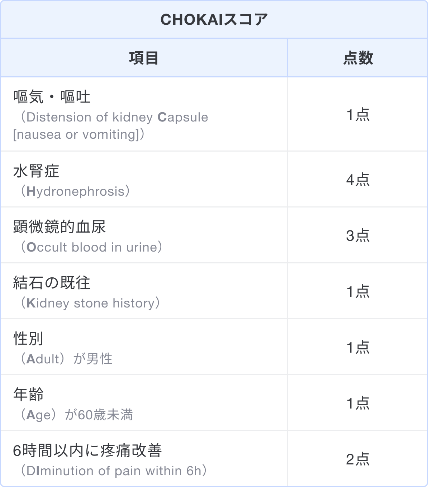
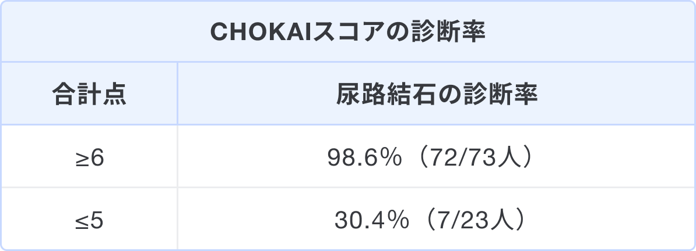

### スコアの解説
CHOKAIスコアは尿路結石の予測スコアである1)。  
各評価項目の英語表記からつけられた名称であり、全7項目のスコアを合計して0〜13点で評価する。スコアの合計が6点以上の場合、尿路結石の可能性が高いとされている。

### 出典
1. [Fukuhara H, et al. Clinical relevance of seasonal changes in the prevalence of ureterolithiasis in the diagnosis of renal colic. Urolithiasis. 2016 Nov;44(6):529-537. doi: 10.1007/s00240-016-0896-3. Epub 2016 Jun 17. PMID: 27314408; PMCID: PMC5063892.](https://pubmed.ncbi.nlm.nih.gov/27314408/)  
2. [Fukuhara H, et al. Internal validation of a scoring system to evaluate the probability of ureteral stones: The CHOKAI score. Am J Emerg Med. 2017 Dec;35(12):1859-1866. doi: 10.1016/j.ajem.2017.06.023. Epub 2017 Jun 13. PMID: 28633903.](https://pubmed.ncbi.nlm.nih.gov/28633903/)  