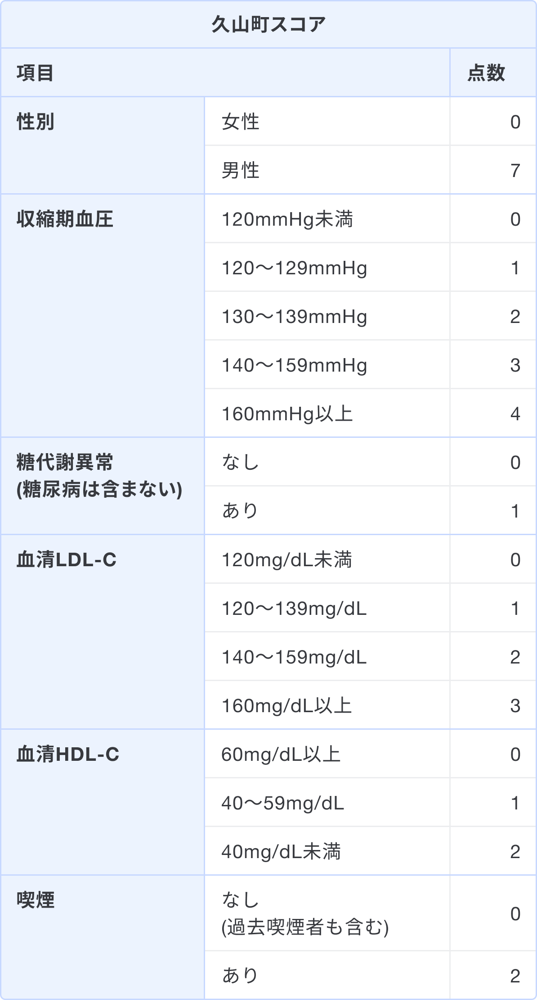
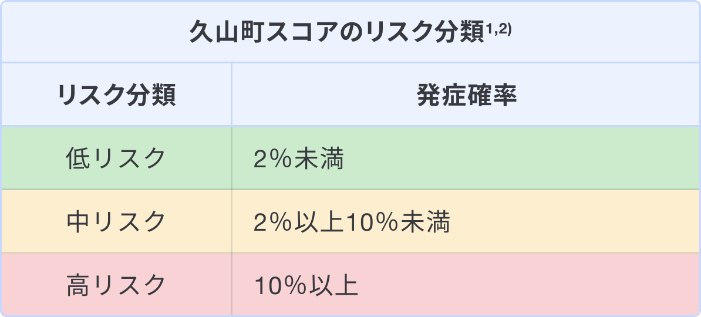
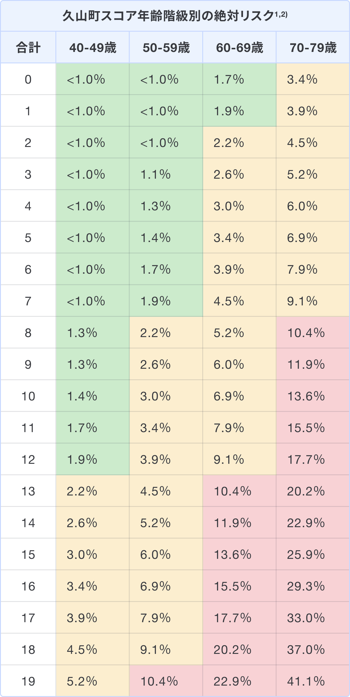

### スコアの解説
久山町スコアは脂質異常症において10年以内の動脈硬化性疾患発症リスクを予測するために用いる1)。  
下記の評価項目より、合計して0〜19点の範囲でスコアリングし、年齢階級別に絶対リスクを評価する。

### 出典

1. [Honda T, et al. Development and Validation of a Risk Prediction Model for Atherosclerotic Cardiovascular Disease in Japanese Adults: The Hisayama Study. J Atheroscler Thromb. 2022 Mar 1;29(3):345-361.](https://pubmed.ncbi.nlm.nih.gov/33487620/)
2. [動脈硬化性疾患予防ガイドライン 2022年版, 一般社団法人日本動脈硬化学会](https://www.j-athero.org/jp/wp-content/uploads/publications/pdf/GL2022_s/jas_gl2022_3_230210.pdf)