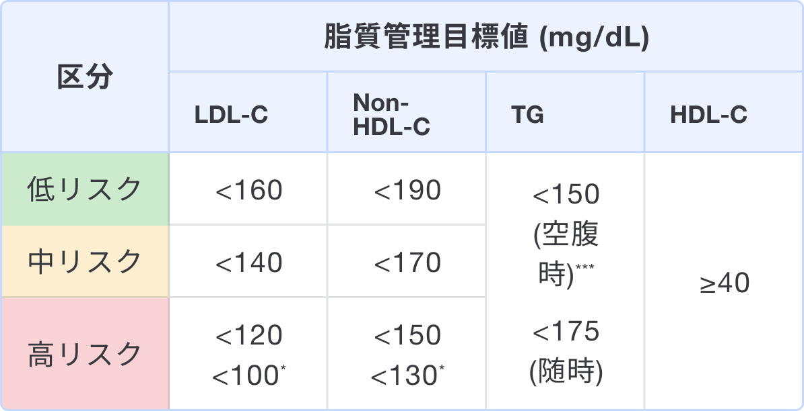
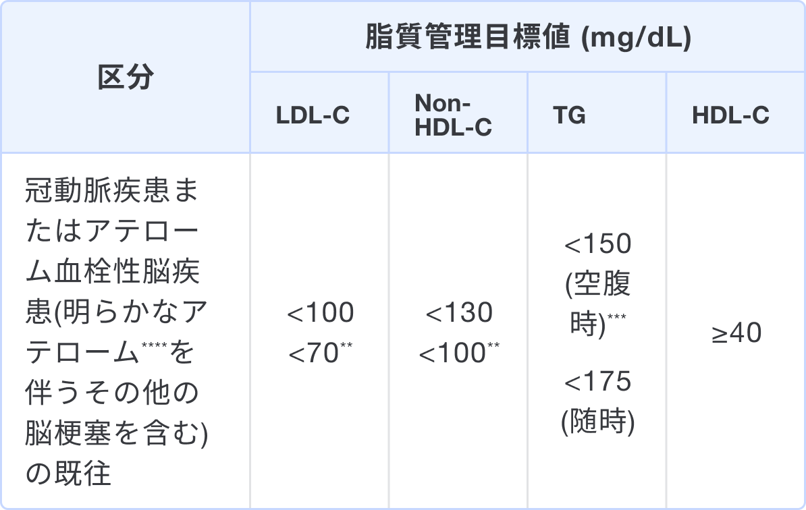

### なぜ久山町スコアを用いるのか、その目的

* 久山町スコアは脂質異常症において10年以内の動脈硬化性疾患（虚血性心疾患、アテローム血栓性脳梗塞）の発症リスクを予測するために用いる1,2)。
* 年齢や性別、既往歴などから簡便にリスク評価が可能。
* 当スコアは『動脈硬化性疾患予防ガイドライン2022年版』のバージョンを用いている。

### いつ使うか/どう使うか

『動脈硬化性疾患予防ガイドライン2022年版』に基づいた手順を解説する2)。
40歳以上80歳未満の脂質異常症スクリーニング陽性患者において、下記の2項目を確認する。

<dl class="gray-box">
   <dt>
      1. 冠動脈疾患またはアテローム血栓性脳梗塞があるか？
   </dt>
   <dd>
      「あり」の場合→<a href="#secondary_prevention">二次予防</a> 
      「なし」の場合→2へ進む。
   </dd>
</dl>

<dl class="gray-box">
   <dt>
      2. 糖尿病（耐糖能異常は含まない）、慢性腎臓病、末梢動脈疾患のいずれかがあるか？  
   </dt>
   <dd>
      「あり」の場合→高リスクに分類 
      「なし」の場合→久山町スコアでリスク分類
   </dd>
</dl>

2で「なし」の場合、当スコアを用いて合計点数から10年以内の動脈硬化性疾患の発症確率を導き、リスク分類を行う。

その後、リスク別に脂質管理を行う。

<h5>治療方針の原則 一次予防</h5>

まず生活習慣の改善を行った後、薬物療法の適用を考慮する

<h5 id="secondary_prevention">治療方針の原則 二次予防</h5>

生活習慣の是正とともに薬物治療を考慮する

<small>
* 糖尿病において、PAD、細小血管症(網膜症、腎症、神経障害)合併時、または喫煙ありの場合に考慮する。(第3章5.2参照) 
** 「急性冠症候群」、「家族性高コレステロール血症」、「糖尿病」、「冠動脈疾患とアテローム血栓性脳梗塞(明らかなアテロームを伴うその他の脳梗塞を含む)」の4病態のいずれかを合併する場合に考慮する。 
*** 10時間以上の絶食を「空腹時」とする。ただし水やお茶などカロリーのない水分の摂取は可とする。それ以外の条件を「随時」とする。 
**** 頭蓋內外動脈の50%以上の狭窄、または弓部大動脈粥腫(最大肥厚4mm以上)
</small>

- <small>一次予防における管理目標達成の手段は非薬物療法が基本であるが、いずれの管理区分においてもLDL-Cが180 mg/dL以上の場合は薬物治療を考慮する。家族性高コレステロール血症の可能性も念頭に置いておく。(第4章参照)</small>
- <small>まずLDL-Cの管理目標値を達成し、次にnon-HDL-Cの達成を目指す。LDL-Cの管理目標を達成してもnon-HDL-C が高い場合は高TG血症を伴うことが多く、その管理が重要となる。低HDL-Cについては基本的には生活習慣の改善で対処すべきである。</small>
- <small>これらの値はあくまでも到達努力目標であり、一次予防(低・中リスク)においてはLDL-C低下率20~30%も目標値としてなり得る。</small>
- <small>高齢者については第7章を参照。</small>

### 使用上の注意点

* 『動脈硬化性疾患予防ガイドライン2022年版』で用いられる久山町スコアはオリジナルの久山町スコアと異なるため、別のツールとして利用する2)。
* 降圧薬を服用している場合、絶対リスクが過小評価される可能性を考慮する2)。
* 久山町研究の対象者が40歳以上であるため、40歳未満には適用できない1,2)。
* 80歳以上の場合は患者個々の状態に応じて治療を行うべきであり、当スコアを使用しない2)。

### 出典

1. [Honda T, et al. Development and Validation of a Risk Prediction Model for Atherosclerotic Cardiovascular Disease in Japanese Adults: The Hisayama Study. J Atheroscler Thromb. 2022 Mar 1;29(3):345-361.](https://pubmed.ncbi.nlm.nih.gov/33487620/)
2. [動脈硬化性疾患予防ガイドライン 2022年版, 一般社団法人日本動脈硬化学会](https://www.j-athero.org/jp/wp-content/uploads/publications/pdf/GL2022_s/jas_gl2022_3_230210.pdf)

### 監修
監修:平山傑（札幌徳洲会病院 副院長/救急科部長）
更新日時:2025年1月25日