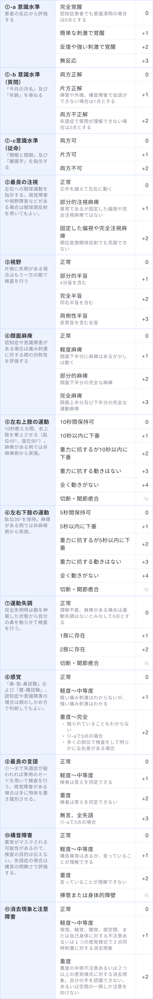

### スコアの解説
NIHSSは、急性期における脳卒中の重症度を評価するために用いるスコアである。  
National Institutes of Health Stroke Scaleの略で、11項目の各点数を合計して0〜40点で評価する。数字が大きいほど重症である。各項目詳細は計算画面またはNIHSSの公式サイトで確認してほしい1)。

<table>
  <caption>
    NIHSSの解釈9)
  </caption>
  <thead>
    <tr>
      <th>スコア</th>
      <th>解釈</th>
    </tr>
  </thead>
  <tbody>
    <tr>
      <td>21点以上</td>
      <td>重症</td>
    </tr>
    <tr>
      <td>16-20点</td>
      <td>中等症から重症</td>
    </tr>
    <tr>
      <td>5-15点</td>
      <td>中等症</td>
    </tr>
    <tr>
      <td>4点以下</td>
      <td>軽症</td>
    </tr>
  </tbody>
</table>

ここでは各項目の判断に困るケースについて解説する。

### 出典
1. [NIH Stroke Scale公式サイト](https://www.ninds.nih.gov/health-information/stroke/assess-and-treat/nih-stroke-scale)  
9. [Zhuo Y, et al. Estimation of stroke severity with National Institutes of Health Stroke Scale grading and retinal features: A cross-sectional study. Medicine (Baltimore). 2021 Aug 6;100(31):e26846.](https://pmc.ncbi.nlm.nih.gov/articles/PMC8341321/#R9)