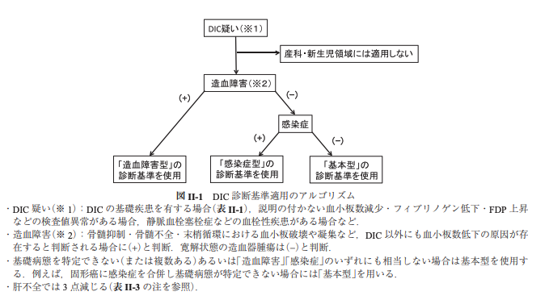

### なぜ新DIC診断基準を用いるのか、その目的
* 新DIC診断基準は日本血栓止血学会が2017年に改訂した基準。
* 基本型・造血障害型・感染症型の3病型に分け、6〜7項目でスコアリングし簡便にDICの診断が可能。

### いつ使うか/どう使うか
次の場合などにDICを疑い、診断基準適用のアルゴリズムに従う1)。
* DICの基礎疾患を有する（下リスト参照）
* 説明できないPlt減少・Fib低下・FDP上昇などの検査値異常がある
* 静脈血栓塞栓症などの血栓性疾患がある

    スコア評価による治療方針の例1)

### DICの基礎疾患1)
1. 感染症  
   - 敗血症  
   - その他の重症感染症（呼吸器、尿路、胆道系など）  
2. 造血器悪性腫瘍  
   - 急性前骨髄球性白血病（APL）  
   - その他の急性白血病  
   - 悪性リンパ腫  
   - その他の造血器悪性腫瘍  
3. 固形癌（通常は転移を伴った進行癌）  
4. 組織損傷  
   - 外傷  
   - 熱傷  
   - 熱中症  
   - 横紋筋融解症  
5. 手術後  
6. 血管関連疾患  
   - 胸部および腹部大動脈瘤  
   - 巨大血管腫  
   - 血管関連腫瘍  
   - 膠原病（血管炎合併例）  
   - その他の血管関連疾患  
7. 肝障害  
   - 劇症肝炎  
   - 急性肝炎  
   - 肝硬変  
8. 急性膵炎  
9. ショック  
10. 溶血、血液型不適合輸血  
11. 蛇咬傷  
12. 低体温  
13. その他

注：産科・新生児領域に特徴的なDIC基礎疾患は本診断基準を適用しないので、ここでは示していない。

### 鑑別すべき代表的疾患・病態1)

#### Plt数低下
1. 血小板破壊・凝集亢進  
   - **TMA**: TTP、HUS、HELLP症候群、造血幹細胞移植後TMA  
   - HIT  
   - ITP、SLE、APS  
   - 体外循環など  
2. 骨髄抑制・骨髄不全  
   - 造血器悪性腫瘍（急性白血病、慢性骨髄性白血病の急性転化、骨髄異形成症候群、多発性骨髄腫、悪性リンパ腫の骨髄浸潤など）  
   - 血球貪食症候群  
   - 固形癌（骨髄浸潤あり）  
   - 骨髄抑制を伴う化学療法あるいは放射線療法中  
   - 薬物に伴う骨髄抑制  
   - 一部のウイルス感染症  
   - 造血器悪性腫瘍以外の一部の血液疾患（再生不良性貧血、発作性夜間血色素尿症、巨赤芽球性貧血など）  
3. 肝不全、肝硬変、脾機能亢進症  
4. 敗血症  
5. Bernard-Soulier症候群、MYH9異常症（May-Hegglin異常症など）、Wiskott-Aldrich症候群  
6. 希釈  
   - 大量出血  
   - 大量輸血、大量輸液  
   - 妊娠性血小板減少症など  
7. 偽性血小板減少症  

#### FDP上昇
1. 血栓症: 深部静脈血栓症、肺塞栓症など  
2. 大量胸水、大量腹水  
3. 大血腫  
4. 線溶療法  

#### Fib低下
1. 先天性Fib血症、先天性低Fib血症、Fib異常症  
2. 肝不全、低栄養状態  
3. 薬物性: L-アスパラギナーゼ、副腎皮質ステロイド、線溶療法  
4. 偽低下: 抗トロンビン作用のある薬物（ダビガトランなど）投与時  

#### PT時間延長
1. ビタミンK欠乏症、ワルファリン内服  
2. 肝不全、低栄養状態  
3. 外因系凝固因子の欠乏症またはインヒビター  
4. 直接経口抗凝固薬内服  
5. 偽延長: 採血量不十分、抗凝固剤混入  

#### AT活性低下
1. 肝不全、低栄養状態  
2. 炎症による血管外漏出（敗血症など）  
3. 顆粒球エラスターゼによる分解（敗血症など）  
4. 先天性AT欠乏症  
5. 薬物性: L-アスパラギナーゼなど  

#### TAT、SFまたはF1+2上昇
1. 血栓症: 深部静脈血栓症、肺塞栓症など  
2. 心房細動の一部

### 出典
1. [1.日本血栓止血学会 DIC診断基準 2017年版. DIC診断基準作成委員会. 血栓止血誌 2017;28(3):369-391](https://www.jstage.jst.go.jp/article/jjsth/28/3/28_2017_JJTH_28_3_369-392/_pdf)

### 監修
監修:平山傑（札幌徳洲会病院 副院長/救急科部長）
更新日時:2025年1月25日