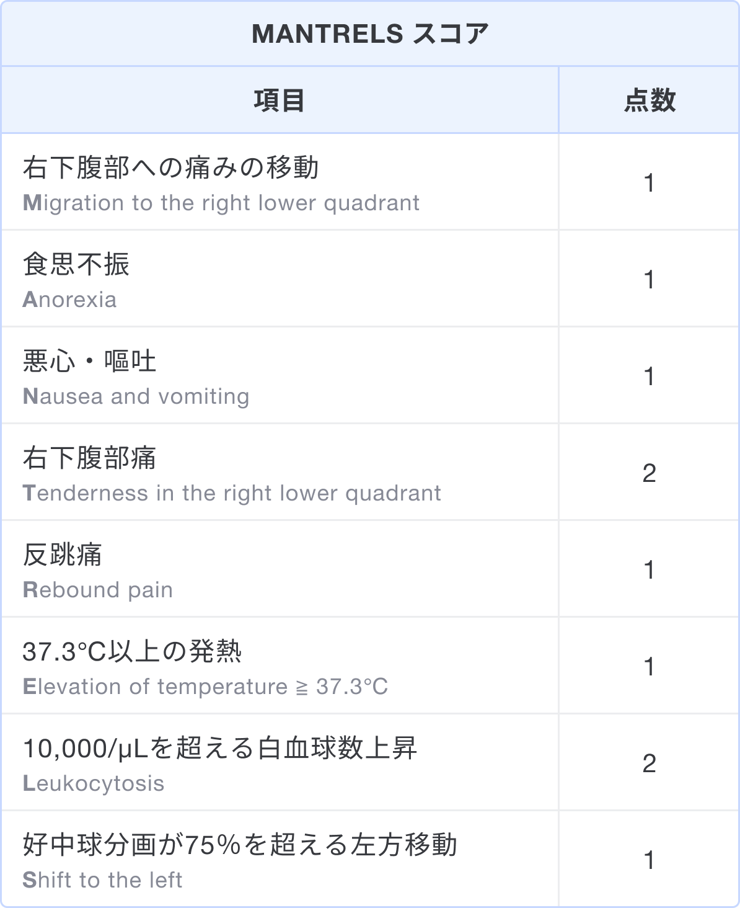

### スコアの解説
Alvarado スコアは、虫垂炎を疑った場合に入院の必要性を判断するために用いるスコアである1)。  
各項目の頭文字から「MANTRELS スコア」とも呼ばれ、下記8項目のスコアを合計し0〜10点で評価する。

### 出典
1. [Alvarado A. A practical score for the early diagnosis of acute appendicitis. Ann Emerg Med. 1986 May;15(5):557-64. doi: 10.1016/s0196-0644(86)80993-3. PMID: 3963537.](https://pubmed.ncbi.nlm.nih.gov/3963537/)  
