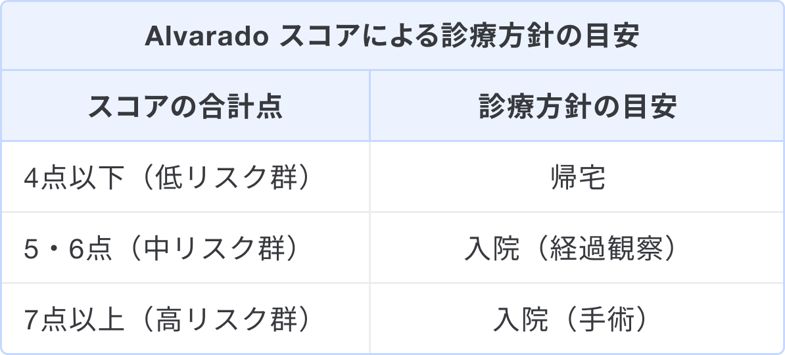

### なぜAlvarado スコアを用いるのか、その目的
* Alvarado スコアは、虫垂炎を疑った場合に入院の必要性を判断するために用いるスコアである1)。  
* 病歴や症状、身体所見、採血結果を簡便にスコア化し、虫垂炎のリスクを評価する。  
* スコア評価が最適化されているのは成人の男性であり、他属性の患者の評価には十分注意を払う。

### いつ使うか/どう使うか
虫垂炎を疑う際に、当スコアを念頭に置いて診察を行う。

まずは「**成人男性において、4点以下なら入院は不要である**」と記憶したい。その理由は次の2点である2)。
- Alvarado スコアが5点以上の虫垂炎において、感度は高いが特異度は低いため。  
- 5点以上の診療方針の細分化や女性・小児限定でみるとばらつきが大きいため。

以下の表はAlvarado スコアのオリジナル論文で提唱している診療方針の目安である。

補足として、次の2点が推奨されている1)。

* 100％の診断は難しく、状況によってカットオフを変更することが推奨されている。  
* 診断が難しい場合は4〜6時間ごとに再評価し、スコアが変わらないまたは増加している場合は手術を考慮すべきである。

虫垂炎の確定診断は小児では超音波検査、成人ではCT検査を用いる。

### 使用上の注意点
* 小児ではPediatric Appendicitis Score（PAS）の方がAlvarado スコアと比べて成績が良いといわれており、小児の虫垂炎の入院評価にはPASを使用するべきである3)。  
* Alvarado スコアが5点以上の特異度は40％前後であり、確定診断に用いるべきではない2)。リスクベネフィットを加味して画像診断を行うこと。  
* 救急外来での誤診において、虫垂炎は全体で6位、小児に限れば2位という報告がある4)。虫垂炎の診断は難しいという前提で診療に当たるべきである。

### 出典
1. [Alvarado A. A practical score for the early diagnosis of acute appendicitis. Ann Emerg Med. 1986 May;15(5):557-64. doi: 10.1016/s0196-0644(86)80993-3. PMID: 3963537.](https://pubmed.ncbi.nlm.nih.gov/3963537/)  
2. [Ohle R, O'Reilly F, O'Brien KK, Fahey T, Dimitrov BD. The Alvarado score for predicting acute appendicitis: a systematic review. BMC Med. 2011 Dec 28;9:139. doi: 10.1186/1741-7015-9-139. PMID: 22204638; PMCID: PMC3299622.](https://pubmed.ncbi.nlm.nih.gov/22204638/)  
3. [Kulik DM, Uleryk EM, Maguire JL. Does this child have appendicitis? A systematic review of clinical prediction rules for children with acute abdominal pain. J Clin Epidemiol. 2013 Jan;66(1):95-104. doi: 10.1016/j.jclinepi.2012.09.004. PMID: 23177898.](https://pubmed.ncbi.nlm.nih.gov/23177898/)  
4. [Vissers RJ, Lennarz WB. Pitfalls in appendicitis. Emerg Med Clin North Am. 2010 Feb;28(1):103-18, viii. doi: 10.1016/j.emc.2009.09.003. PMID: 19945601.](https://pubmed.ncbi.nlm.nih.gov/19945601/)

### 監修
監修:平山傑（札幌徳洲会病院 副院長/救急科部長）
更新日時:2024年10月10日