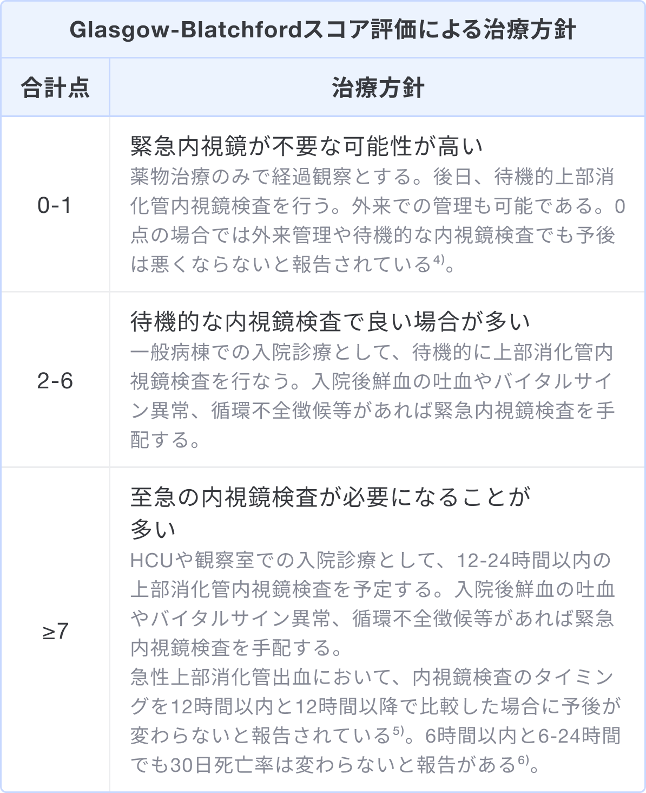

### スコアの解説
Glasgow-Blatchford スコアは上部消化管出血での内視鏡的止血・輸血の必要性や死亡のリスクを予測するためのスコアである。

Glasgow-Blatchford スコアは収縮期血圧と血清BUN値、血清Hb値、その他の項目で構成され、合計0〜23点の範囲でスコアリングされる1)。

スコア評価による治療方針の例3)

### 出典

1. [非静脈瘤性上部消化管出血における内視鏡診療ガイドライン.（2015年）日本消化器内視鏡学会](https://www.jstage.jst.go.jp/article/gee/57/8/57_1648/_pdf/-char/ja)  
2. [Blatchford O, Murray WR, Blatchford M. A risk score to predict need for treatment for upper-gastrointestinal haemorrhage. Lancet. 2000 Oct 14;356(9238):1318-21. doi: 10.1016/S0140-6736(00)02816-6. PMID: 11073021.](https://pubmed.ncbi.nlm.nih.gov/11073021/)  
3. [ホスピタリストのための内科診療フローチャート. 第2版.清田雅智監修.シーニュ出版](https://www.amazon.co.jp/dp/4990950550/)  
4. [Stanley AJ, Ashley D, et al. Outpatient management of patients with low-risk upper-gastrointestinal haemorrhage: multicentre validation and prospective evaluation. Lancet. 2009 Jan 3;373(9657):42-7. doi: 10.1016/S0140-6736(08)61769-9. Epub 2008 Dec 16. PMID: 19091393.](https://pubmed.ncbi.nlm.nih.gov/19091393/)  
5. [International Consensus Upper Gastrointestinal Bleeding Conference Group. International consensus recommendations on the management of patients with nonvariceal upper gastrointestinal bleeding. Ann Intern Med. 2010 Jan 19;152(2):101-13. doi: 10.7326/0003-4819-152-2-201001190-00009. PMID: 20083829.](https://pubmed.ncbi.nlm.nih.gov/20083829/)  
6. [Lau JYW, et al. Timing of Endoscopy for Acute Upper Gastrointestinal Bleeding. N Engl J Med. 2020 Apr 2;382(14):1299-1308. doi: 10.1056/NEJMoa1912484. PMID: 32242355.](https://pubmed.ncbi.nlm.nih.gov/32242355/)  