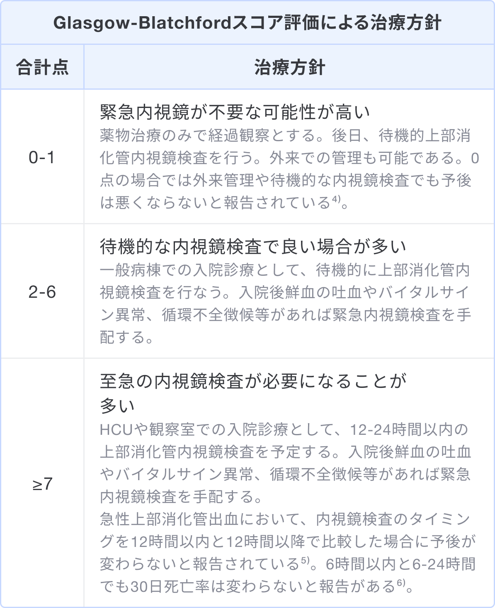

### なぜGlasgow-Blatchford スコアを用いるのか、その目的

* Glasgow-Blatchford スコアは上部消化管出血での内視鏡的止血・輸血の必要性や死亡のリスクを予測するために用いる。
* スコア項目は問診とバイタルサイン、血算生化学検査の結果のみで内視鏡所見を含まないため、初療段階での速やかなリスク評価が可能である。
* 特に低リスク症例の絞り込みに有用で、0または2点をカットオフ値にすると内視鏡的止血や輸血の必要性を感度95%以上で予測でき、死亡症例もなく外来管理が可能である。

### いつ使うか/どう使うか

上部消化管出血を疑った場合にまず想起すべきは、眼前の症例が内視鏡検査の適応かどうか、そしていつ行うべきか、である。そこで当スコア等でリスクを評価し、治療方針を判断する。**基本的にスコアの点数が高いほど、緊急性や死亡率が高い。**

スコア評価による治療方針の例3)

### 使用上の注意点

* 2点以上で内視鏡検査を行うタイミングはガイドラインでも明確にはなっていない。ここで紹介した治療方針はあくまで目安であり、施設の方針や患者背景を考慮して検査を行うべきである。
* スコア項目の心不全や肝臓疾患の評価は適切な判断が求められる。軽度肝酵素上昇は肝臓疾患に、軽度拡張機能障害は心不全に含むべきではない。
* あくまで上部消化管出血のリスク評価スコアであり、小児や小腸出血、下部消化管出血が疑われる患者では使用すべきではない。

### 出典

1. [非静脈瘤性上部消化管出血における内視鏡診療ガイドライン.（2015年）日本消化器内視鏡学会](https://www.jstage.jst.go.jp/article/gee/57/8/57_1648/_pdf/-char/ja)  
2. [Blatchford O, Murray WR, Blatchford M. A risk score to predict need for treatment for upper-gastrointestinal haemorrhage. Lancet. 2000 Oct 14;356(9238):1318-21. doi: 10.1016/S0140-6736(00)02816-6. PMID: 11073021.](https://pubmed.ncbi.nlm.nih.gov/11073021/)  
3. [ホスピタリストのための内科診療フローチャート. 第2版.清田雅智監修.シーニュ出版](https://www.amazon.co.jp/dp/4990950550/)  
4. [Stanley AJ, Ashley D, et al. Outpatient management of patients with low-risk upper-gastrointestinal haemorrhage: multicentre validation and prospective evaluation. Lancet. 2009 Jan 3;373(9657):42-7. doi: 10.1016/S0140-6736(08)61769-9. Epub 2008 Dec 16. PMID: 19091393.](https://pubmed.ncbi.nlm.nih.gov/19091393/)  
5. [International Consensus Upper Gastrointestinal Bleeding Conference Group. International consensus recommendations on the management of patients with nonvariceal upper gastrointestinal bleeding. Ann Intern Med. 2010 Jan 19;152(2):101-13. doi: 10.7326/0003-4819-152-2-201001190-00009. PMID: 20083829.](https://pubmed.ncbi.nlm.nih.gov/20083829/)  
6. [Lau JYW, et al. Timing of Endoscopy for Acute Upper Gastrointestinal Bleeding. N Engl J Med. 2020 Apr 2;382(14):1299-1308. doi: 10.1056/NEJMoa1912484. PMID: 32242355.](https://pubmed.ncbi.nlm.nih.gov/32242355/)  

### 監修
監修:平山傑（札幌徳洲会病院 副院長/救急科部長）
更新日時:2024年10月10日