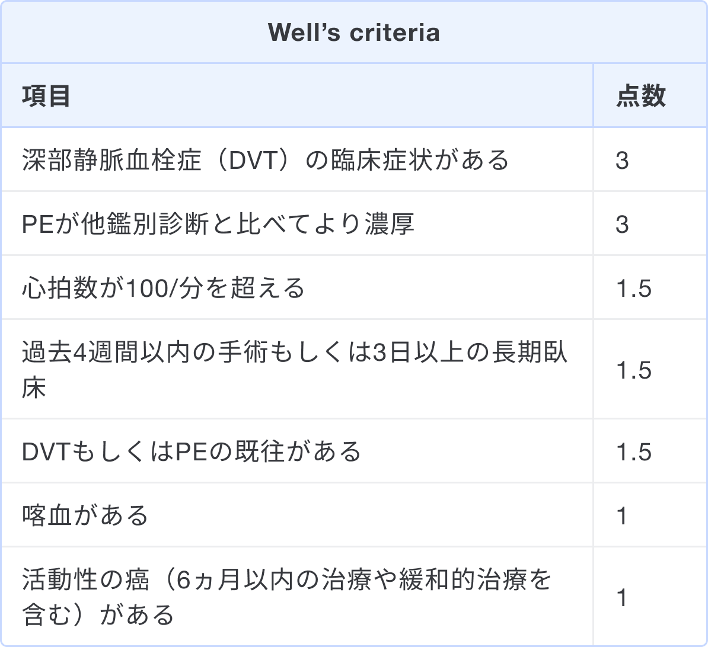
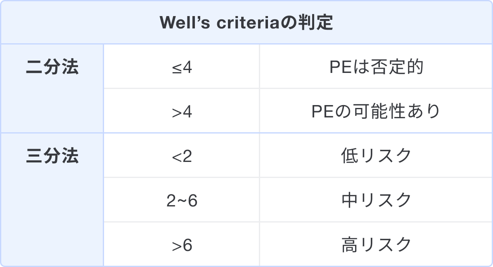

### スコアの解説
Well's criteriaは、肺血栓塞栓症（PE）の3ヶ月以内の発症を予測するためのスコアであり、全7項目の点数を合計し、0点から12.5点でスコアを記載する1)。

上記7項目の合計点数を計算し、判定する。

### 出典
1. [肺血栓塞栓症および深部静脈血栓症の診断, 治療, 予防に関するガイドライン.（2017年改訂版）](https://js-phlebology.jp/wp/wp-content/uploads/2019/03/JCS2017_ito_h.pdf)  